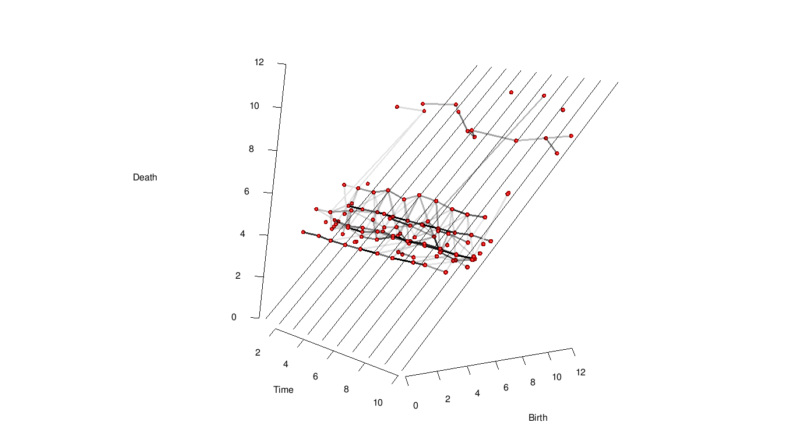
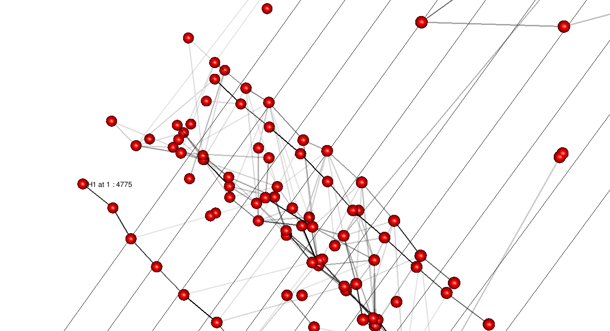
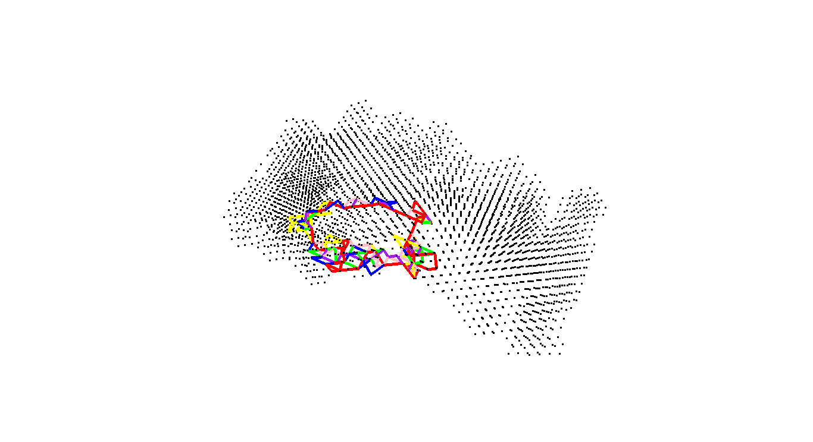

Wayne-State-TDA
================

Currently this repository contains code to produce vineyards that aid in time series analysis of the persistent homology of data. Much of the code deals specifically with the fMRI use case but can easily be generalized to other use cases.

Motivation
==========

One would like to identify if a persistent homological feature is stable over time. This repository contains rudimentary tools to identify and study such features.

One such feature found in fMRI data is displayed below.


Usage
=====


Pre-reqs are found in the *libraries.R* script.

The *calc\_vineyard* function takes as input the output of the *ripsDiag* function from the R package TDA with the arguments library='Dionysus' and cycleLocation=TRUE. It will create a directory containing the calculated vineyard.

Here is a link to the TDA R package. https://cran.r-project.org/web/packages/TDA/index.html

Once this is done the function *read\_in\_data* can be used to read in the calculated vineyard data from the new directory.

``` r
data<-read_in_data(dir_names = c('./vine_0.5_1/', '2512rdACC_masked_time_', '_patient1.rds'))
```

The function *plot_vineyard* creates the vineyard.

``` r
vineyard(data,range=c(1,10))
```

 To produce the entire vineyard, or specify a range, run the same code but with the *range* named argument changed to the range of time slices you prefer (up to how many you have). In this case there are 290.

If we want to investigate particular grapes in the vineyard we can do that by setting the named argument *id* to TRUE. With this option on we can right-click on a grape and see what time slice it is in and what index it has in the data allowing us to retrieve information about the feature.

``` r
vineyard(data,range=c(1,6),id=TRUE)
```

 Now that we know the index of the grape in question we can plot the loop it represents in the acc.

``` r
acc<- read.csv('acc.csv',header = FALSE)[,1:3]
plot_loops(loops = list(data[[1]]$cycleLocation[[4775]]),data=acc)
```

If we see, as with this grape, that it is likely part of a stable vine accross all timeslices we can use *vinehunter* to collect the homology class in each time slice that is closest. Here is a look at the first six in this vine.

``` r
loops<-vinehunter_primitive(4775,diags = data[1:6])

plot_loops(loops,data = acc)
```


